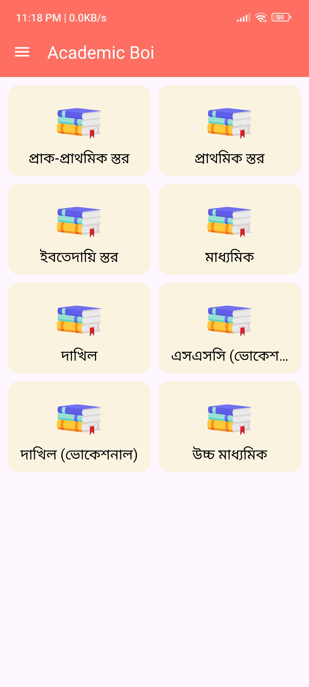
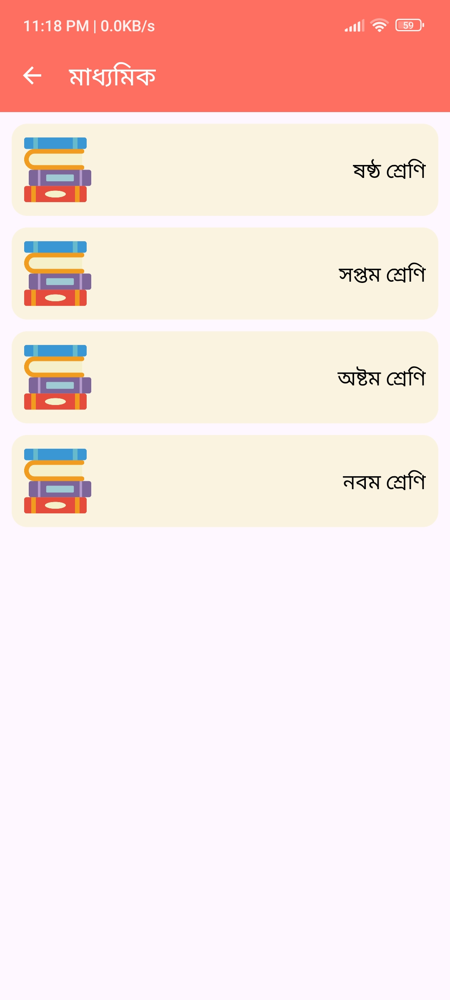
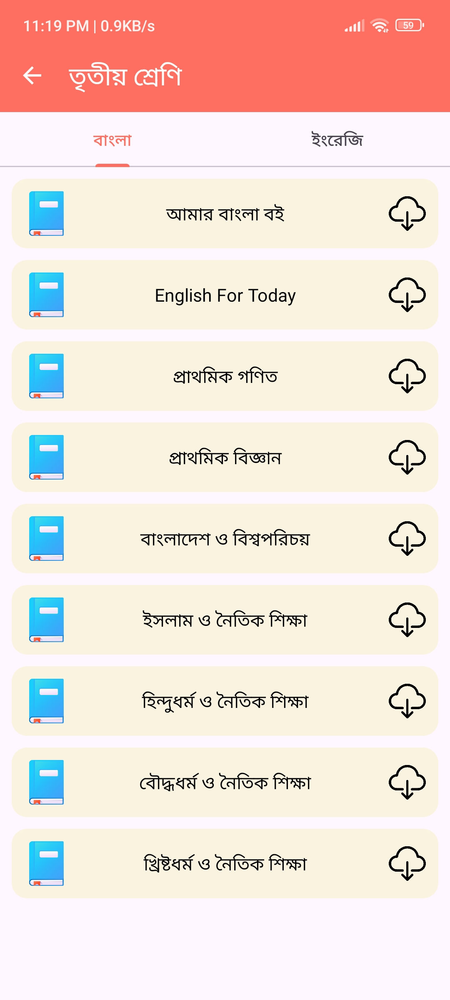
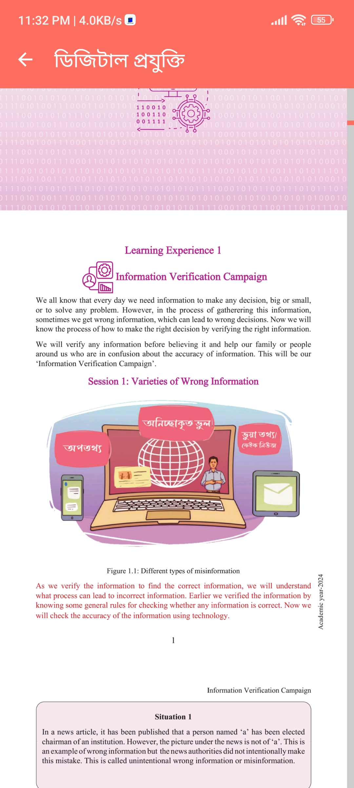
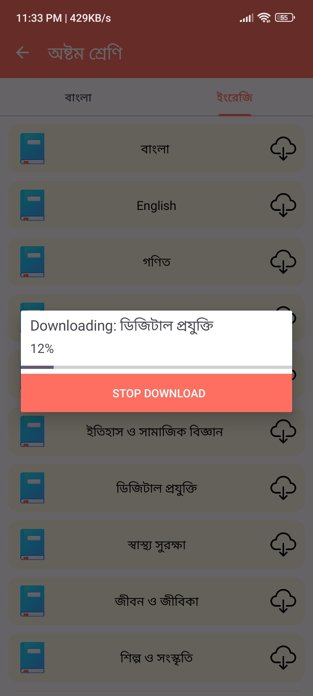

# 📚 Academic Boi Online

Academic Boi is a rich ebook reader app designed for students in Bangladesh. It provides easy access
to all textbooks from Class 1 to 12 right at your fingertips. Students can effortlessly browse
through levels, classes, and books to read in PDF format.

## 🏷️ Features

- **Interactive Dashboard:**  
  Students can select different levels and classes from a well-organized dashboard. A list of
  classes will be visible for each level.

- **Simple Navigation:**  
  After selecting a class, a list of all the books in that class will be displayed. Choosing a book
  opens it in PDF format, enhancing the reading experience.

- **Tab Bar:**  
  A tab bar is available for some books, ensuring easy navigation for users.

- **PDF View:**  
  The PDF files of the books will open in a user-friendly interface, making scrolling and page
  turning easy.

## 📖 Book List (by Class)

- **Class 1-2:** Bangla, English, Mathematics
- **Class 3-5:** Bangla, English, Mathematics, Science, Social Science, Religious Education
- **Class 6-8:** Bangla, English, Mathematics, Science, Social Science, Religious Education
- **Class 9-10:** Bangla, English, Mathematics, Physics, Chemistry, Biology, History, Geography
- **Class 11-12:** Bangla, English, Mathematics, Physics, Chemistry, Biology, Business Education,
  Other Subjects

> Note: Multiple books are available for each class.

## ✅ Why This App is For You?

- **User-Friendly:** A simple and effective interface designed for students.
- **Offline Access:** Download books to read offline.
- **Updated Content:** Regular updates with new textbooks included.

## 📷 Screenshots

<div style="display: flex; flex-direction: column; align-items: center;">
    <div style="display: flex; justify-content: space-around; width: 100%;">
        
        
        
    </div>
    <div style="display: flex; justify-content: space-around; width: 100%;">
        
        
    </div>
</div>

## 📥 Download Now!

Enhance your learning experience with Academic Boi. Download now and simplify your study process!

# Database Update Process

## Step 1: Update `check_version.php` File

1. Open the `check_version.php` file.
2. Set the current version by adding the following line:
    ```php
    $current_version = 2; // Set the current version
    ```
3. Increment the version by adding 1 to the current version:
    ```php
    $current_version + 1; // Set the next version
    ```

This will ensure that the versioning of the database is properly handled.

## Step 2: Edit, Update, or Delete Data Using Database Browser

1. Open the `academic_boi.db` file using a database browser tool (e.g., DB Browser for SQLite).
2. Perform the required operations on the database:

- **Edit**: Modify existing data.
- **Update**: Change specific entries in the database.
- **Delete**: Remove unwanted data.

3. Once the changes are made, **export** the modified database file.

## Step 3: Upload the Updated Database to the Server

1. After exporting the updated `academic_boi.db` file, **upload** it to the server using FTP or File
   Manager in cPanel.

After completing these steps, the database will be updated on the server, and the new data will be
saved.